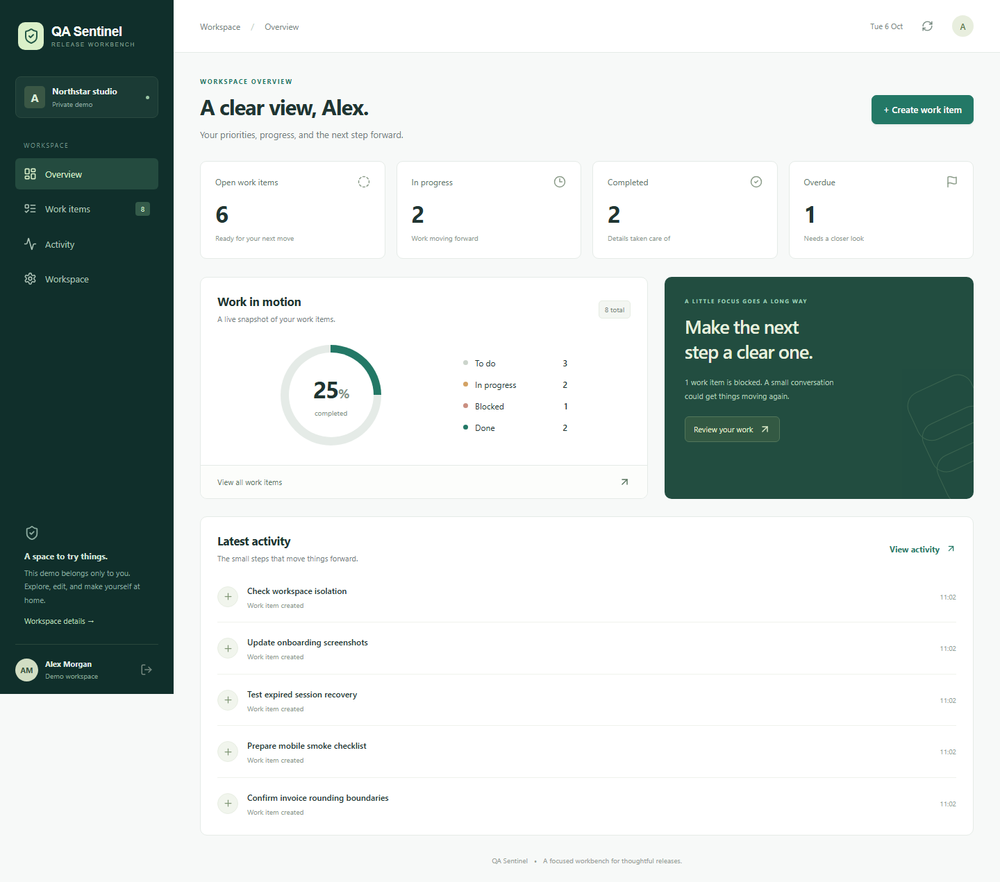
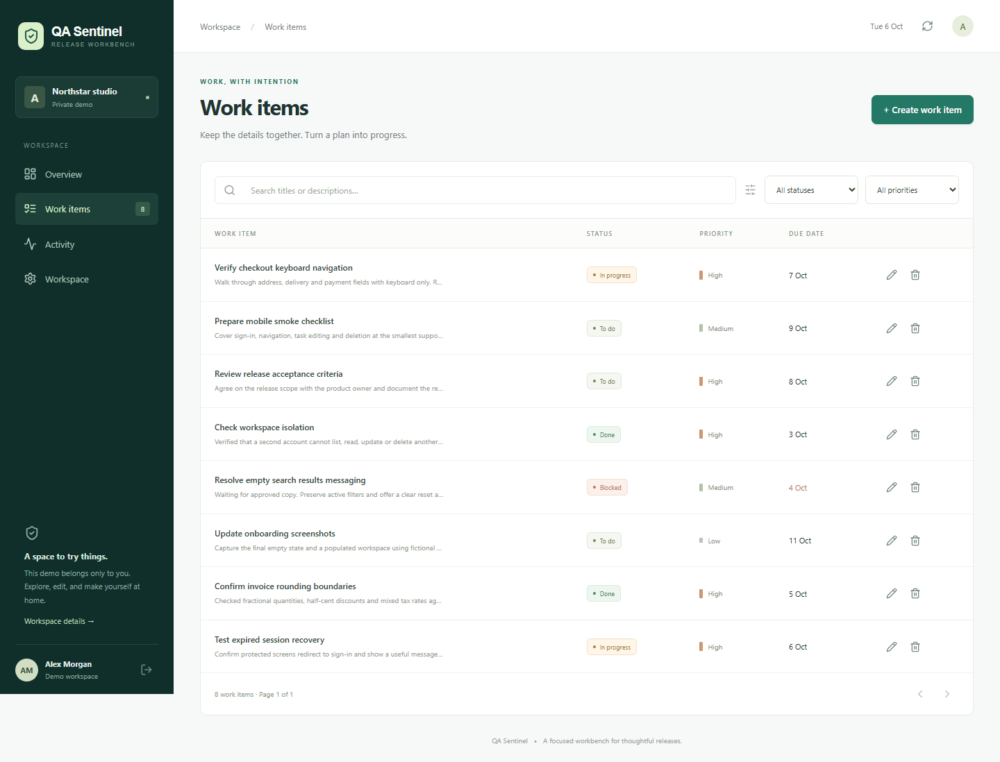
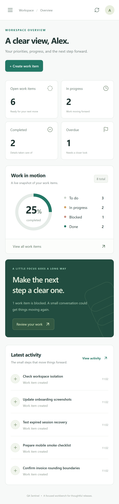

# QA Sentinel

A QA automation portfolio built around a real, deliberately small task-management application. The release workbench gives the tests something meaningful to protect: private accounts, searchable work items, revision-safe edits, and account deletion.

**Recruiter route:** open the live demo, choose **Explore a private demo**, create and complete a work item, then inspect the test plan and deliberate-bug evidence. Each demo gets separate fictional data; no shared password is needed.

This is an AI-assisted portfolio project. Its source, reproducible tests, limitations, and development findings are provided so its engineering decisions can be reviewed. It is not a claim of prior commercial employment or independently acquired expertise.

## What is included

- React/TypeScript workbench with account registration, login/logout, persistent local sessions, protected pages, task CRUD, search, status/priority filters, pagination, dashboard, activity, and deletion controls.
- FastAPI REST API with SQLite, scrypt password hashes, hashed session tokens, owner-scoped queries, optimistic concurrency, request limits, server validation, and production Origin checks.
- pytest domain and API integration tests; Vitest client validation tests; Playwright HTTP contracts and desktop/tablet/mobile workflows.
- Four reproducible mutation demonstrations. Each starts from a passing baseline, injects a documented defect into a disposable copy, and requires a real assertion failure. Production source is never mutated.
- GitHub Actions gates, HTML/JUnit/JSON reporting, test plans, traceable test cases, bug reports, Docker configuration, and Windows launchers.

## Screenshots

Captured from the actual running application with fictional data:





## Architecture

```text
React pages -> typed fetch client -> /api same-origin proxy
                                      |
                              FastAPI routes + validation
                                      |
                     authentication / repository / transactions
                                      |
                        SQLite with foreign keys and WAL

pytest -> isolated database per test
Playwright -> isolated app process + ephemeral database
mutation runner -> disposable source copies + targeted pytest cases
```

The API owns authorization, validation, and concurrency. The frontend mirrors validation for helpful feedback, but is never trusted as a security boundary. Each write uses an explicit transaction. A task revision must match before update or delete; stale changes return 409. Tasks and activity are scoped to their owner. Account deletion cascades to tasks, sessions, and activity.

SQLite is intentional: this SUT needs reproducibility more than a distributed database. Schema version 1 is initialized idempotently in `backend/app/db.py`. A future schema change requires an explicit migration; there is no claim of an existing multi-version migration system.

## Structure

```text
backend/app/       routes, schemas, auth, storage, security, domain operations
backend/tests/     isolated pytest fixtures, API and domain tests
src/components/    reusable dialogs, editor, feedback, activity
src/pages/         authentication, overview, work items, workspace
src/lib/           API adapter, types, validation and unit tests
tests/api/         Playwright black-box API contracts
tests/ui/          browser workflows and negative cases
tests/support/     account lifecycle and navigation fixtures
scripts/           mutation experiments, reporting, local launchers
docs/              screenshots, evidence, deployment notes
.github/workflows/ CI gates and downloadable reports
```

## Run locally

Prerequisites: Python **3.12**, Node **22 or 24**, pnpm **11.19.0**. No API keys or external database are required.

```bash
python -m venv .venv
# Windows: .venv\Scripts\Activate.ps1
# macOS/Linux: source .venv/bin/activate
python -m pip install -r backend/requirements-dev.txt
pnpm install --frozen-lockfile
python -m uvicorn app.main:app --app-dir backend --host 127.0.0.1 --port 8006
# In another terminal, with the same project directory:
pnpm dev
```

Open `http://127.0.0.1:5178`. On Windows, **Start QA Sentinel.cmd** installs dependencies and starts hidden local servers; **Stop QA Sentinel.cmd** stops only its authenticated launcher. Local data is in `.runtime/sentinel.db` and survives restarts. Do not commit or share that directory.

### Configuration

Copy `.env.example` to `.env` when overriding defaults. FastAPI reads it through python-dotenv. Defaults are sufficient locally.

| Variable | Purpose |
| --- | --- |
| `APP_ORIGIN` | Exact browser origin, default `http://127.0.0.1:5178` |
| `ENVIRONMENT` | `production` enables Secure cookies and requires Origin on writes |
| `DATABASE_PATH` | SQLite path, default `.runtime/sentinel.db` |
| `API_PROXY_TARGET` | Vite-only API destination, default `http://127.0.0.1:8006` |
| `PUBLIC_BASE_URL` | Explicit HTTPS deployment to run the selected smoke tests against |

Never publish `.env`, databases, session cookies, or launcher control state.

## Testing strategy and pyramid

The lowest layer tests validation boundaries and password behavior without a browser. Most rules are exercised at the API/database layer: authorization, transaction conflicts, expiry, limits, deletion, and status codes. A smaller set of complete browser workflows proves these layers cooperate and verifies responsive interactions. UI cases run at three sizes; those executions are not three different business requirements.

See [TEST_PLAN.md](TEST_PLAN.md) and [TEST_CASES.md](TEST_CASES.md) for risk priorities and traceability. The suite uses real databases and HTTP, with a single deliberately mocked 503 to exercise recovery. It uses fresh accounts, bounded assertions, and no fixed browser sleeps or automatic retries.

```bash
python -m ruff check backend scripts
python -m pytest --junitxml=reports/pytest.xml
pnpm test
pnpm build
pnpm exec playwright install chromium
pnpm test:e2e
python scripts/mutation_demo.py
python scripts/report.py
pnpm report
```

If an existing Windows system pytest temporary directory has another owner's permissions, use a fresh project-local base: create `.runtime` and add `--basetemp=.runtime/pytest-run` to pytest. Playwright launches its own API on **8007** and web server on **5188** and refuses to reuse running processes. These tests cannot reset your normal local workspace. Close unrelated processes on those test ports first.

Focused commands: `pnpm test:api`, `pnpm test:ui`, or `pnpm exec playwright test --project=mobile`. For a stability check use `pnpm exec playwright test --repeat-each=2`. Reports go in ignored `reports/` and `playwright-report/`; traces and screenshots are retained only for failures.

Public smoke tests create and delete their own fictional accounts. Set `PUBLIC_BASE_URL` and run `pnpm test:public` only against your own deployment. They select four workflows on desktop/mobile and use one worker to respect production rate limits. They do not replace the full isolated suite.

## Proving the tests catch bugs

[BUG_REPORT_EXAMPLES.md](BUG_REPORT_EXAMPLES.md) contains four deliberate regression reports plus real development findings. `python scripts/mutation_demo.py` verifies each baseline passes and each introduced bug triggers the intended test assertion. Import errors, fixture errors, and unexpected test counts do not count as detection. [Recorded evidence](docs/evidence/mutation-results.json) is dated and reproducible; four detected selected mutations are **not** a whole-project mutation score.

## CI and reports

On every push and pull request, GitHub Actions installs pinned dependencies, lints Python, runs pytest and Vitest, type-checks/builds React, runs Playwright, and runs mutation demonstrations. The job uploads HTML reports, JSON, JUnit and failure traces even when tests fail. `scripts/report.py` creates a readable consolidated HTML report from actual machine output and appends a CI step summary. CI fails on test or mutation-gate failures; no retry can silently turn a failing test green.

## API

| Method / path | Behavior |
| --- | --- |
| `GET /api/health` | Readiness response |
| `POST /api/auth/register` | Create private account, 201 |
| `POST /api/auth/login` | Authenticate and set session cookie |
| `POST /api/auth/demo` | Create isolated temporary demo, 201 |
| `GET /api/auth/me` | Current user; anonymous 401 |
| `POST /api/auth/logout` | Revoke session and clear cookie, 204 |
| `DELETE /api/account` | Confirm password (or `DELETE DEMO`); delete associated data |
| `GET /api/tasks` | `q`, `status`, `priority`, `page`, `page_size` |
| `POST /api/tasks` | Validated create, 201 |
| `GET /api/tasks/{id}` | Owner's resource; otherwise 404 |
| `PUT /api/tasks/{id}` | Full input plus current `revision`; stale 409 |
| `DELETE /api/tasks/{id}?revision=N` | Version-checked delete, 204 |
| `GET /api/dashboard` | Counts and recent activity |

Interactive local API documentation: `http://127.0.0.1:8006/api/docs`. Invalid schemas produce 422, oversized request bodies 413, rate limits 429. Responses omit submitted secrets from errors.

## Deployment and security limits

See [docs/DEPLOYMENT.md](docs/DEPLOYMENT.md). Vercel hosts the frontend and proxies `/api` to a free Render Python service. Same-origin cookies avoid third-party-cookie dependencies. No database credential is required.

The free hosted filesystem is ephemeral: **demo and registered-account data can reset on deploy/restart**. Treat the public instance as a disposable portfolio demo and use fictional data. Recruiter demos also expire after 24 hours. Local SQLite or a Docker volume persists across restarts. A real business deployment needs durable storage, backups, monitoring and tested recovery.

Other known gaps: no email verification/password recovery, multi-factor authentication, collaborative roles, formal accessibility audit, load/soak tests or penetration test. Search case folding follows SQLite's basic ASCII behavior. Mobile/tablet runs use Chromium emulation, not real hardware or Safari. Rate limiting is process-local and assumes a single API worker; it is not a distributed abuse-control service. Standard account sessions last seven days; demo expiry limits their effective lifetime. Production is capped at 500 accounts and 200 tasks per account, with latest 100 activity records retained. Capacity limits are deliberate demo safeguards.

## Future improvements

Add Firefox/WebKit CI, axe accessibility checks and real-device exploration, coverage thresholds based on measured baselines, property-based input tests, a wider mutation tool, contract/schema drift checks, load profiles, durable Postgres hosting, and email recovery. Expand test coverage with a specific risk or escaped defect rather than merely increasing test counts.
